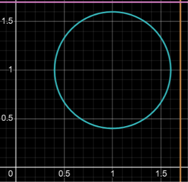
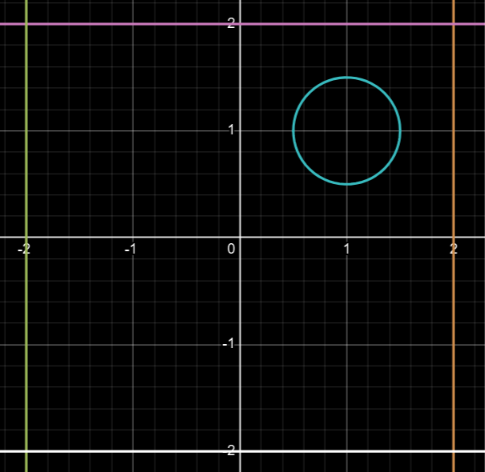

# Hey

So I will try to explain whats going on here
the v1.csv has 8 test cases

0,0    1,1    -1,-1    0,1    1,1.5    0.5,1    1.5,1    1,0.5

7 of these 8 test cases have an output 1, the only one which had an output 0 is the 2nd test case i.e. index 1
Butt, it gives a huge error. So I have a 1 predictor with myself

When i changed a test case to give 0, it also performed poorly

now I will use this
0,0    1,1    1.2,1    0,1    1,1.5    0.5,1    1.49,1    1,0.51

outputSequence is 1 0 0 1 1 1 0 0

Tested this on 10^5 iterations. Next Step: INCREASE HIDDEN NEURONS :P
---
# 4 Hidden layer neurons
Now open v2.csv

So on multiple combinations of iterations and alpha, here is what I obeserve

### Observations:
- Its super confident on the 1st and 4th test case. In general its confident in the first 4.
- It is confused in the last 4, where the values are super close or literally on the boundary

Even after 10^5 iterations...
0.17690281125899812 best MAE

# More Neurons... (5-6)
at 5 neurons best MAE - 0.184712290345156

This does not make 4 neurons inherently better, just know that weight and bias initializations play a curcial role
I'm not setting a seed for now, it is how it is :\

at 6 neurons
best MAE 0.18108386821265388

# MORE...
8 neurons - 0.14643484457493228
### This broke ethe 15% barrier, but took 100K iterations.
Let's half that now

Hmm something funny happened
SO like I did 2-3 more iterations than i was doing, because the best I saw was near 0.21. And I was like, 8 neurons HAS to be better than 4 neurons
So as I am testing these hyper params mroe and more, Seed mightve been important

but i cant keep the same seed for all of the weight initializations, i will have duplicates of the same thing, so im unsure as of now

12 neurons - 0.18343841073552863

Well the problem I stated above happened again. so from 10^5, I moved to millions of iterations
The 5 million run took 281 seconds. and it performed worse than the 200k iteration which took 25 times less time...

## What would Tanvay do?
Simple, I can't seed them, and i feel the values clsoer to infinity are taking too long to converge, so i jsut clip them weights using np.clip

### ooo super smart
yeah ik, now open v3.csv

# MORE?!..
While there is no fixed number, the recommended is 8-12
But who am I if not an explorer.
Also I asked claude, and he said, well I'm taking a huge grid while training

so the model learns to just "predict outside" as most of the training points are outside... So sad :C

Now I have clipped weights from -1.5 to 1.5, and roughly 40% of the training examples are inside (changed radius to 0.6)

 

Here I compare the previous(right) and the new(left) input ranges
New test weights test_inputs = np.array([[[0,0]],[[1,1]],[[1.2,1]],[[0,1]],[[1,1.6]],[[0.6,1]],[[1.59,1]],[[1,0.41]]])

Now open v3.csv to check these results
16 neurons at 50k gave MAE 0.14648296290925594
Slightly unfair for the 8 neuron, so I'll give it another chance. 50k isnt a small number in any means. 
It went 17.23% this time

SO I think 10 neurons could break 15%, why is it taking me 16?
I'm not sure, but I will look into it later.
